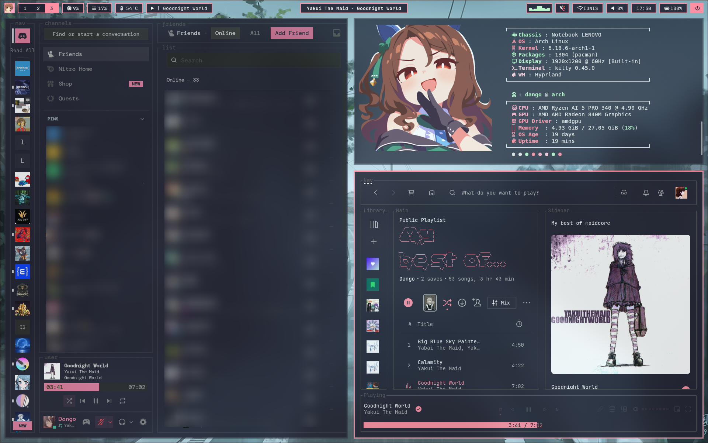
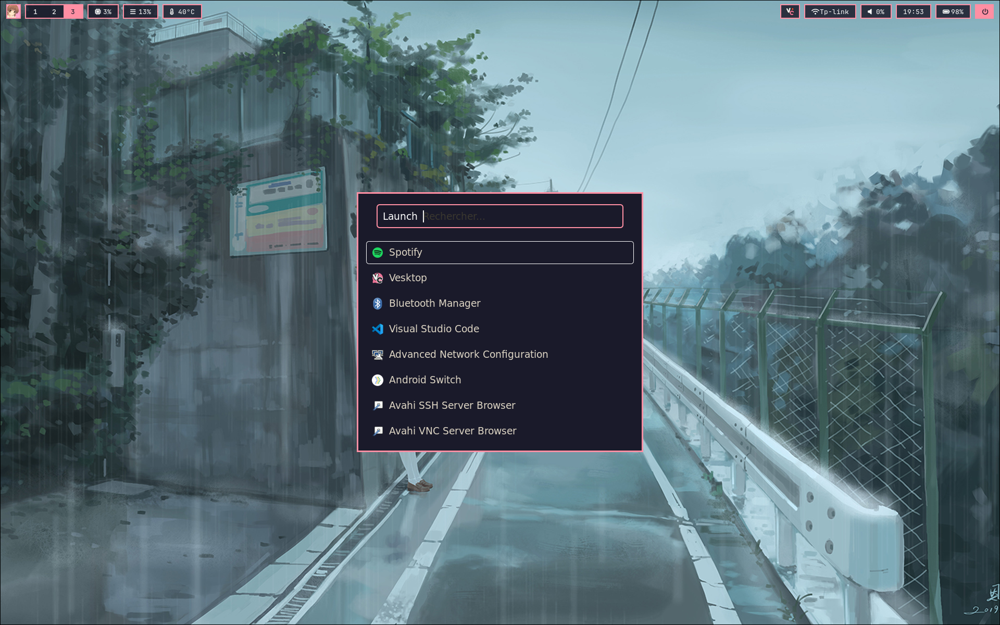

<h1 align="center">
  
  d a n g o ' s r i c e
  
</h1>

<p align="center">
  
  
</p>

<p align="center">
  
  
  
  
</p>

---

## Preview

<p align="center">
  
  
</p>

---

## About

A carefully crafted **Hyprland** rice featuring a **dark and pink** color palette, inspired by:

- **Clannad**
- **Gruvbox**

This setup draws heavy inspiration from the amazing [HyDE Project](https://github.com/HyDE-Project/HyDE) and [DerAnsari's dots](https://github.com/DerAnsari/hyprland-dots).

---

## Components

| Component | Name |
|-----------|------|
| **Window Manager** | [Hyprland](https://hyprland.org/) |
| **Display Manager** | SDDM |
| **Color Scheme** | Dark Pink |
| **Status Bar** | Waybar |
| **Launcher** | Rofi |
| **Browser** | Zen |
| **Editor** | Visual Studio Code / Nano |
| **Wallpaper** | swww |
| **Notifications** | Dunst |
| **Music** | Spotify + spicetify |
| **Discord** | Vesktop |
| **Terminal** | Kitty |
| **Shell** | Fish |
| **Fetch** | Fastfetch |
| **File Manager** | Thunar |
| **Audio** | Pipewire |

---

## Installation

### Quick Install

```bash
git clone https://github.com/dangoquidev/Dotfiles.git
cd Dotfiles
./setup.sh
```

### Installation Steps

The installer features a beautiful TUI interface:

<table>
<tr>
<td width="50%">

**Step 1:** Run the setup script
```bash
./setup.sh
```

**Step 2:** Choose your action
- `Install` — Fresh installation
- `Restore` — Restore from backup


**Step 3:** Select features to install
- Pick individual components
- Or install everything at once

That's it!

---

## TODO

### **Upcoming Features (hopefully...)**
- [ ] My own color palette for all applications
- [ ] Wallpaper switcher 
- [ ] Custom notification daemon configuration
- [ ] Multiple theme, or anime based theme

---

## Credits & Inspiration

- **[HyDE Project](https://github.com/HyDE-Project/HyDE)** — Fastfetch and Hypr setup
- **[DerAnsari](https://github.com/DerAnsari/hyprland-dots)** — Rice inspiration
- **[Catppuccin](https://github.com/catppuccin)** — Color palette ideas

---

## Support

If you like this rice, consider giving it a star!

<p align="center">
  
</p>
